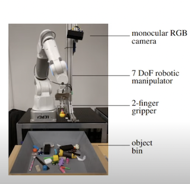

# Part 01 : What is Reinforcement Learning

[https://www.youtube.com/watch?v=JHrlF10v2Og&list=PL_iWQOsE6TfXxKgI1GgyV1B_Xa0DxE5eH&index=1](https://www.youtube.com/watch?v=JHrlF10v2Og&list=PL_iWQOsE6TfXxKgI1GgyV1B_Xa0DxE5eH&index=1)

## 1-1 들어가기 전에...

### 물체를 잡아 올리는 기계 만들기

이러한 기계를 이용해서, 특정한 물체를 잡는다고 가정하자.

보통은 다음의 단계를 거칠 것이다.

1. 기계를 이용해 사물의 이미지를 캡쳐한다.
2. 어떠한 method를 거친다.
3. x,y,z coordinates를 생성한다.
4. gripper를 이용해서 object를 들어올린다.

그런데 너무 많은 option이 있다.

### Option 1 : 문제를 인식하고 solution을 만든다.

- 카메라를 세팅해
- 3d reconstruction 알고리즘을 만들어
- object의 기하학적인 공간정보를 파악하고
- gripper를 이용해서 잡을 수 있도록 조정한다.
    - 근데 물체를 잡는 것도 잘 따져야한다.
    - 물체가 가볍다면 들어올리면 되지만
    - 물체가 무겁다면 무게중심을 잘 파악해서 들어올려야 한다.
    - 예상을 벗어나는 물체라면 (말랑말랑하고 형태가 뭉게지기 쉽다)
    가운데를 정확히 잡는게 중요하다
    
    ⇒ 물체마다 각각의 Solution을 구성해야하므로 어렵다.
    

### Option 2 : 머신러닝 알고리즘으로 구성한다.

이 gripper의 행동을 Supervised Learning으로 가정한다면,
물체의 조건마다 판단하고 행동해야하기에 상당한 Challenge이다.

이유

- 일반적인 Supervised Learning은 X→Y의 구조로, Labeling이 필요함
    - Label은 이미지마다 xyz position을 잡아야 함
- 학습 자체도 까다로움

## 1-2 수업 목표

Develop Reinforcement Learning Methods that can allow us to automate the process of acquiring skills of this .

⇒ 이런 Skill들을 자동으로 얻을 수 있는 “강화학습"의 방법을 학습

“성공적인 행동들”을 준다기 보단,
반복적으로 “경험"을 줌으로써
”가능한 outcome”을 학습해
실제 세계에서 발생 가능한 상황을 확인

즉, 위의 모델이 물건을 들어올리는데 성공하던 실패하던, 그 경험 자체를 가지고 “grasping system”을 구축함

위의 시스템 학습 방법

- 1단계 : 자동으로 데이터를 학습함 (사람이 안함)
    - 데이터의 Input = Image, Output =  (x,y,z) tuple
    - 이 tuple이 항상 성공적으로 Labeling하지는 않는다.
    
    위의 Input과 Output을 기반으로 {성공, 실패}의 결과 label이 생성됨
    
- 2단계 : 강화 학습 알고리즘에 적용
- system이 정책을 만들어내고, 특정 task에 대해서  그냥 데이터를 막 수집할 때 보다 더 나아짐
- 4단계 : 마련된 정책을 Real World에 적용해 추가적으로 데이터를 수집
- 1단계~4단계 반복작업

## 1-3 강화학습이란?

### 강화학습의 2가지 방향

2가지 존재

1. “학습 기반 의사 결정을 위한 수학 공식”
    
    알고리즘을 직접 design해야 함
    
2. “경험을 기반으로 의사 결정을 만들고 통제하는 접근법”
    
    손으로 만든 controller나 특정 정책에 의지하기보단, 데이터에 의지
    

### ML과의 차이점

일반적인 Supervisd Learning : 여러가지 가정이 필요함

$\mathsf{given}\space \mathcal{D} = \{(x_i,y_i  \}
\\
\mathsf{learn \space to\space predict} \space y \space \mathsf{from} \space x \quad f(x)\approx y$

- i.i.d data로 가정
    - 이전 X가 현재 y 예측에 영향을 주지 않음
- Known ground truth outputs in training (정답을 알고 훈련한다.)
    - output을 사실상 알고있음

RL : 

- 데이터가 i.i.d를 따르지 않는다.
    - 현재 데이터의 output이 미래의 input에 영향을 준다.
- Ground Truth Answer가 정해지지 않음
    - 오직 “성공" or “실패"만 정해짐
    - 더 일반적으로, reward만 알고있음

### 강화학습의 구성과 예시

강화학습의 요약

- Model Decision이 System을 구축하고 (Action을 수행하고)
- 어떠한 상태 속에서 Environment가 그에 상응하는 결정을 내림
- 이 과정을 여러번 반복함
    - finite horizon : 정해진 수만큼 반복해서 학습한다.
    - infinite horizion : 무한히 반복해서 학습한다.

현실 예시

“강아지에게 trick을 가르치자”

- action : 근육 수축
- observations(상태) :  시각, 후각 등을 포함
- reward : 주는 무언가
    - 잘 하면 주고, 원하지 않는 행동을 했으면 주지 않는 것

“로봇을 학습시키자”

- action : motor currents or torques
- observations : 카메라 이미지
- rewards : 어떠한 임무 수행의 측정
    - 달리기 → 얼마나 빨리 달렸는가

Inventory management

- action : 무엇을 구매할 것인가?
- observations : 현재 시점의 inventory level
- reward : 이윤

복잡한 물리 문제

“로봇 팔을 이용해서 못을 박는다고 하자”

⇒ 자동으로 좋은 solution을 학습할 것이다.

- atari 벽돌깨기 게임의 경우, 한 쪽 벽 위의 공간에 공을 넣으면 쉽게 많은 포인트를 딸 수 있다.

현실세계

어떤 물건을 잡아라 

- 물건이 많이 붙어있으면, 물건의 측면에 압력을 주어 떼어낸 후, 하나씩 집어 올린다.
- 제대로 못 잡아도 다시 자리를 잡고 다시 집어올리면 된다 ⇒ 반복해서 학습하다보면 나아진다.
- 모양도 다르고 형태도 다른 여러 물건들 사이에서 물건을 들어올려야 한다.

Traffic Control

하얀 자동차 = 일반적 자동차, 빨간 자동차 = 자율차량

- circle regulate traffic
    - 하얀 차
        - 정상 주행으로 원을 그림
    - 자율 차량
        - 속도를 늦췄다 올리는 등 dynamic하게 움직임
            
            ⇒ traffic jam이 발생함을 깨닫는다.
            
        - 정속 주행을 학습
            
            ⇒ traffic jam이 해소된다.
            
- 8 traffic
    - 일반 주행
        - 교차로에서는 서로 한대씩 보내주고 가는 형태를 그리며 약간의 jam이 발생
    - 자율 차량
        - 모든 차량이 반쪽짜리 원에 다 들어가게 만듦
        
        
        
        - 아무도 교차로에서 기다리지 않는다.