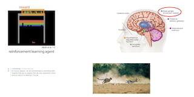

# PART03 : What other problems do we need to solve to enable real-word sequential decision making?

## 1. Beyond Learning from reward

### 기본적인 강화학습은 “보상"을 최대한다.

- 강화학습은 System과 상호작용하면서
- ground truth reward를 감독하며
- ground truth output이 아니더라도
- 올바른 output과 올바른 action을 취해
- reward를 최대화 하도록 학습한다.

### Sequential Decision making에는 더 많은 문제들이 있다.

- Learning Reward Functions (inverse RL)
- Transferring Knowledge between domains (transfer learning, meta-learning)
    - 서로 다른 domain이지만 과거의 유사한 task가 있는 새로운 task에 어떻게 적용하는가?
- Model Based RL
    - 예측을 위해 학습하고, 예측으로 act함
    - 행동을 직접 학습하는 대신 정책을 반영하여 세상에 맞게 적용함
    

## ⭐️ 2. Reward는 어디서 오는가? (학기 수업의 절반을 다룰 예정)

### 예시

- task : 물건을 잡기 ⇒ reward : 물건을 성공적으로 잘 잡았는가?
- task : 강아지 훈련 ⇒ reward : 원하는 행동을 취했는가?
- Atari game : 점수
- Pour Glass of Water : Glass에 물을 잘 따랐는가?

일반적인 상황을 가정하자.

### 몇년전 ai lab에서 내놓은 논문을 보면,
human agents는 보상을 받으며 일하지만, 너무 희소해서 일생에 있어서 한두번밖에 경험하지 못한다고 말함

- Reddit에서 누가 이 말에 대해서 “이 글 쓴 사람은 불쌍하다..” 라고 말했지만
- 사실 좀 비극적이어도, 우리가 현실 세계에서 해결해야 할 많은 task를 반영하고 있음
- 해당 CS285도 CS로 졸업하는 학생이 “이 수업을 들었었다"라고 나중에 reward로써 반영하기 위해서 들을 수도 있다.
- 근데 이건 살면서 한번 일어날 수도 있는 일이지 반드시 일어난다고 보장도 못한다.

### 뇌 속에는 basal ganglia와 같은 보상 매커니즘을 담당하는 기관이 존재함

- 그러나 매우 복잡한 구조를 가지고 있음
- 그래서 쉽게 reward로 인식하지는 않는다.
    - 간단한 event에 대해서는 쉽게 켜지지 않음

### 적절한 행동에는 적절한 reward를 주는 뇌 machineary가 있다.

- 이게 왜 반드시 필요한가? 에 대해서는 예시를 들면 쉽게 말할 수 있음
- 가젤을 쫓는 치타가 있다고 생각하자.
    - 치타가 막 방방 뛰다가 실수로 가젤을 잡았다고 생각하자.
    - 이러면 이 행동에 대해서 보상이 주어지고 이 행동을 더 자주 할 것이다.
    - 그럼 사실 사냥꾼의 입장에서는 치타를 잡기 더 어려워지기 때문에, 보상일지도...?
    - 따라서 이러한 행동에 대한 더 정교하고 자세한 guiding mechanism이 필요하다.

## 3. Are there other forms of supervision?

위의 경우는 매우 희소하고, 매우 occasional reward임

### Demontration으로 학습 (어떤 행동의 representation을 demonstration으로부터 얻어냄)

- observed behavior를 직접 복사함
- observed behavior로부터 reward를 추론해냄 (inverse RL)
    - 어린 치타가 어른 치타의 모습을 봄으로써 reward를 받아냄

### 세상을 관측해 학습

- 미래를 예측
    - 물리학의 일반적인 구조(structure)를 학습했다면, 이 지식을 이용해 미래에 일어날 행동을 예측
- 비지도 학습

### 다른 task를 통해 학습

- Transfer Learning
    - 아직까지 본 적이 없는 task를 해결할 때 사용 가능
    - CS 학위를 취득해본적은 없지만, 고등학교를 졸업하거나 다녀본 경험을 이용해서 어떻게 교육을 받는지에 대한 구조를 알고, 이를 이용해서 학위를 취득할 수 있을 것이다.
- Meta-learning : 학습을 위한 학습 ( * 난 배운적 없으니 추가 설명 필요!!)
    - 어떻게 배우는지에 대해서 배움으로써, 더 잘 배울 수 있게 함
    - 과거의 자료를 통해서 아마 다 배웠을 것으로 추정됨

## 4. 다양한 학습 방법론

### Imitation Learning

사람이 운전하는 것과 유사하게 학습함으로써 자율주행 자동차를 만들 수 있다.

- reward supervise하는 강화학습이 아님

⇒ 다음주에 자세히 다룰 예정

### Inferring Intentions

다른 agents가 하는 useful behaviors를 관찰하는 것은 단순 행동 모방학습보다 낫다.

- 아이들의 심리를 다루는 연구
    - 책장에 책을 넣으려고 하지만, 책장이 닫혀있을 경우 아이가 보여주는 행동 관찰
    - 남성은 책을 들고 책장에 넣으려하지만, 실패하는 과정을 보여줌
    - 이 때, 아이가 “저 남성이 책장에 책을 넣으려 하는구나"를 추론하고, 책장을 열어줌
- 이 경우, 더 효과적으로 목표를 달성할 수 있다.

### Inverse RL (Robot 연구 예시)

로봇에게 물을 붓는 방법을 직접 가르쳐줌

- 컵의 위치는 계속해서 바뀌고
- 사람이 로봇의 팔을 잡고 물을 붓는 방법을 계속 학습시켜줌
- 최종적으로, 로봇은 사람의 도움 없이도, 물 컵의 위치를 파악해 물을 따를 수 있음
- 즉, 과정은 반대여도 목표는 같음

### 예측

사람이 의사결정하는데 기본적인 요소임 

- “the idea that we predict the consequences of our motor commands has emerged as an important theoretical concept in all aspects of sensorimotor control”
- 운동 명령의 연속된 결과를 예측한다는 아이디어는 감각운동 통제의 측면에서 중요한 이론적 개념이다.

## 5. Using Predictive Models

### Model-based RL 에서 연구됐던 주제

- robot과 object가 있음
- robot과 object는 interact함
    - 초기 로봇은 그냥 랜덤하게 움직이는 모양을 그림
    - experience를 특정 행동을 위한 정책 학습에 사용되는게 아니라, 다음을 예측하도록 함
    - 그렇게 하면 지금 이미지를 보고, 미래에 어떤 행동을 취할지를 고려함
- 최종적으로는 자신이 팔을 어디로 움직였을 때, 물건이 어디로 움직일지를 예측한 이미지를 보여줌
- 실제 실험은 우하단의 이미지에서 빨간 점의 물건을 초록 점에 옮기도록 실험
    - 여러 series의 action을 판단해보고
    - 올바른 방향으로 움직이는 action을 선택해 수행함

### Using Tools with Predictive Models

Annie 라는 학생의 실험

- Predictive Model을 이용하여, 특정 Tool을 사용할 수 있도록 모델을 확장시키자.
- 빨간 물건을 치우기 위해 스폰지를 이용해 치우거나
- 파란 물건을 치우기 위해 후크를 이용해 올릴 수도 있기도 하고
- 학습하지 않았음에도, 물통을 이용해 쓰레기를 가장자리로 치우기도 함

## Predictive Model을 활용한 Video Game

- 왼쪽 이미지 : 모델이 예측한 이미지
- 가운데 이미지 : 실제 게임
- 오른쪽 이미지 : 두 이미지의 차이

⇒ 예측이 정확하지는 않지만, 질적으로는 맞다고 판별

즉, 적을 공격하면 사라지고, 여러명의 적이 나타나는 구조

그러나 가끔 이슈가 있음

- 오른쪽 이미지에서는 보이지 않지만,
- 모델이 예측하던 도중 흰색 유저가 한명이 더 생기고, 검정 유저는 팔이 하나가 더 생김
- 모델이 조금 이상하게 일반화 하면서 생기는 문제