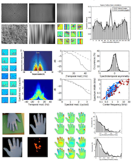

# PART04 : How do we build Intelligent Machines

## 1. How do we build Intelligent Machines

PART 1, 2 쯔음 한 번 다뤘던 내용임

### 어디서 부터 시작해야하는가?

- logical place to start = 인간의 뇌와 유사하게 하자
    - 뇌를 개별 module로 생각하고, 이 module을 프로그램하자.
    - Old Study : 뇌를 Individual Parts로 쪼개고 개별 function을 고려
    - 최근 : 뇌를 해부학적으로 기능마다 쪼개어 그 역할을 정교하게 밝혀냄
- CS의 관점에서 똑같은 기능을 만들어내려면 너무 짜증나고 어려움
    - 개별 부분마다 구현하는것도 어려움
    - 전부 다 구현하려면 많은 노력이 필요함
    

### 학습 == 지능의 basis라면?

모두가 납득하는 주장이 아니지만, 어떤 주장인지 보기나 하자.

- 모두가 할 수 있는 것들
    - 걷기
- 학습해야만 할 수 있는 것들
    - 운전
- 복잡한 것들을 포함 많은 것들을 배울 수 있다.
    - 대부분은 ‘진화'에 필요하지 않고, 발전하면서 생긴 것들
- 태어날 때 부터 알고 있는 것들은 학습하지 않아도 되지만, 태어날 때 모른다면 학습하면 됨
- 즉, 학습을 통해 지능을 가지고 모든 것들을 할 수 있다.
- 이 Idea에 동의 하건 안하건, 지능을 쌓기 위해 어떻게 계획을 수립할지 생각해보는 것도 재밌다.

## 2. SIngle Algorithm

### 개념

- 개별 module마다 알고리즘을 짠다면?
    - 시각 피질 → 행동 피질을 하나의 알고리즘으로 구축하는 것이 아니라
    - 시각 피질 알고리즘 → 행동 피질 알고리즘 으로 생각하자.
- 90년대와 2000년대 ML의 관점임
- 만약 “하나의 유연한 알고리즘이 모든 걸 할 수 있다면?”
    - 하나의 강력한 알고리즘으로 지능의 basis를 학습한다면?
    - 자극적이지만(provocative) 매력적인 생각임
    - 작업량 자체를 줄이기 때문
    - 원래라면 모든 개별 파트마다 알고리즘을 짜야 했으나, 하나의 유연한 알고리즘이 전체를 대체 가능
- 실제 뇌는 하나의 single algorithm이라는 순환적 근거가 존재
    - 혀를 이용해서 시각 피질의 역할을 수행하기도 함
    - 혀의 전극을 이용하여, 혀에 무언가가 닿았을 때 카메라를 인식하고
    - 눈을 감거나 시각장애가 있는 사람에게 혀를 이용해 시력을 갖게 해줌
    - 어린 족제비의 시신경이 끊고 청각 피질에 연결한다면, 그 족제비는 성장하면서  시력을 회복함 ⇒ 즉 청각 피질로 보는 방법을 배우기도 함
- 다양한 종류의 피질들이 서로의 역할을 수행하도록 바뀌는 등 하나의 유연한 알고리즘으로 구축되어 있다.
    - 감각 피질 뿐만 아니라 뇌의 기능들도 하나의 알고리즘으로 되어있다고 생각할 수 있다.
- 사실인지는 모르지만, 매력적인 생각임
- 사실이라면 어떤 알고리즘일지 생각해보자

### Single Algorithm의 역할

- 풍부한 감각 inputs을 방해
    - 실제 세계의 복잡한 문제들을 다뤄야 함

- 복잡한 행동을 선택
    - 선택에 근거가 있고, 통제해야 함

⇒ 어디서 본 것 같다? = RL

## 3.Why Deep RL

### 개념

- Deep : open world의 복잡한 문제를 다룸
- 강화학습 : decision making의 formalism을 제공하고 통제함

### “DL이 뇌와 유사하다”의 증거

- Deep & RL이 개별적으로 뇌가 어떻게 정보를 처리하는지에 대한 모델을 제공한다.
- 일차피질 수용과 수용장 가소성의 비지도학습 논문
    - 10년도 더 전 논문
    - 뇌에 있는 것으로 알려진 Feature를 분석하고
    - 영장류 sensor corpses에서 발견되는 Feature와 비교
- 예시 1번 (제일 위의 파형의 이미지 set)
    - 시각 피질에 자극을 주어 위의 자극
    - Deep NN을 이용하여 자극을 학습해 나오는 Feature를 분석
    - 영장류와 원숭이의 시각 피질에 존재하는 Feature를 분석해 통계량 검증
- 예시 2번 (가운데 colored images)
    - 청각 Feature에도 진행
    - 청각 피질에서 발생하는 자극을 DNN으로 분석하여 Feature를 잡아내고, 이게 뇌파와 얼마나 유사한지검증
- 예시 3번 (마지막 이미지)
    - 촉각에 대한 실험 진행
    - glove에서 dust로 보이는 부분은 촉각이 발생한 지점의 feature로써 모델을 학습시킴
    - 원숭이의 실험에서 존재하는 것으로 알려진 Feature
        - 원숭이의 손이 오목한 드럼 위에 올려짐
        - 드럼을 돌림
        - 뇌에 있는 것으로 알려진 neuron의 촉각을 기록
    - NN으로 학습한 Feature와 원숭이의 Feature에 유사성이 있는지 검증

### “DL이 뇌와 유사하다” 결론

DNN이 뇌가 일하는 것과 동일하게 일한다.

- 교수 : DNN에 관한게 아니라 어떠한 large heavily overparameterized model 이면 통계량을 가지고 Feature를 찾아냄
    - 데이터에 적합한 Feature들은 데이터 자체에 적합하니깐 발견됨
    - 그리고 충분히 powerful model은 내부 구조에 관계 없이 features를 얻어낼 것임

### “RL이 뇌와 유사하다" 증거

뇌가 학습하는 방법에 대한 모델

- RL이 심리학과 신경학에서 연구되었음
    - “보상을 기대하는 심리는 보상 자체와 유사한 발화 패턴이 있다는 인식”이 관찰됨
    - 이를 spectrum dependent plasticity (?)라고도 부름
- basal ganglia가 뇌의 보상 시스템과 연관됨을 파악
- Model-free RL-like Adaptation은  동물 적응 실험에 잘 맞음
    - 항상 그런건 아님

## 4. What can Deep Learning & RL do well now

### Single Flexible Algorithm

사람의 지능과 관련된 광범위한 행동을 습득할 수 있는 유연한 단일 알고리즘은

- 약간 강화학습처럼 보여야 하며
- 딥러닝 모델처럼 대용량이어야 할 것이다.

### Deep RL의 적용 분야 및 학습 특징

- 간단하고 알려진 규칙으로 다뤄지는 domain에서는 고도로 숙달됨
    - ex) GO, Atari 등
- 단일 감각 input에 충분히 experience를 주면 간단한 기술을 학습
- 전문가의 행동을 모방 학습

⇒ 그럼에도 인간 지능, 동물 지능과 비교했을 때 부족한 점들이 몇 개 있다.

### Deep RL의 부족한 점들

- 사람은 매우 빨리 학습
    - 모델은 느림 (엄청나게 많은 experience를 주어야 함)
- 사람은 과거의 knowledge 재사용을 잘 함
    - 사람은 몇 번만으로도 잘 함
    - deep RL에서의 전이학습은 여전히 open domain problem
    - 이 문제를 해결해야 함
- 그러나 사람은 과거 잘못된 경험은 학습하지 않음
    - 몸을 움직이는데 실패하거나 실패해도 크게 동요하지 않음
- 보상 함수가 명확하지 않음
    - 일반적 강화학습에서는 보상함수가 정의되어있고, 옳은 거라고 알려져있지만
    - 실제 세계에서는 명확하지 않음
- 예측의 역할이 명확하지 않음
    - 세계를 모델링 해서 학습하고 그 모델로 계획을 수립하거나
    - 또는 trial and error로 직접 학습하거나
    - 또는 위에 2개 다 해야함

## 5. 결론

강화학습이 잠재적으로 제공하는 것

- 알고리즘적인 방법으로 지능을 얻고
- 개별적인 알고리즘이나 개별적인 module에 구상 없이 적용

그러나 매우 복잡한 모델을 간단한 모델로 단순화하는게 새로운 아이디어는 아님

- 옛날 CS이기도 함
- 앨런 튜링 : 어른의 마음을 가장한 프로그램을 만드는 대신 아이의 마음을 가장한 걸 만드는건 어떨까? 적절한 학습을 거치면 어른의 뇌를 얻을 수 있을 것이다.