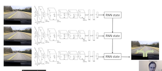

# PART02 : Deep Imitation Learning in Practice

## 1. Can we make it without more data

- DAgger는 Distributional Drift할 때 데이터를 추가해 적용
- 데이터가 Drift하지 않으면, 어떻게 적용해야 하는가?
    - 너무 정확해서   $p_{data}(o_t)$에서 크게 벗어나지 않는다면?
- 전문가의 행동을 매우 정확하게 따라하더라도
- 과적합해서는 안됨

⇒ DAgger 없이도 가능하게 하는 기능이 있음

### 전문가의 데이터를 제대로 학습하지 못하는 이유?

1. Non-Markovian Behavior
    - Observation이 State를 완벽하게 추론하지 못함
    - 사람의 행동은 여전히 “Non-Markovian”임
2.  Multimodal behavior
    - 무감각적으로 다양한 modes에서 행동을 결정

## 2. Non-Markovian Behavior

### 마르코프 가정

- 이전 관측치가 현재 관측치에 영향을 주지 못한다.
- $\pi_\theta(a_t|o_t)$
- 즉, 우리가 똑같은 물건을 2번 보면, 같은 행동을 2번할 것이라는 가정
    - 운전 중, 앞 차가 끼어들면 비켜줄 때도 있지만 막을 때도 있다

### Non-Markovian 가정

- 사람이 일관되지 못하기 때문에, 최적 마르코프 상태가 있어도, 사실 인간은 Non-Markovian상태이다.
- human demonstrators(주로 expert)에겐 very unnatural 함
    - 같은 상태에서 같은걸 2번 봤을 때 같은 행동을 하는게 다름
- $\pi_{\theta}(a_t|o_1, ... ,o_t)$
    - 과거의 모든 관측치에 영향을 받는 상태

### 그럼 이전의 모든 observation을 어떻게 사용하는가?

- 자동차 주행 → 현재 이미지 대신 이전 이미지까지 같이 학습
    1. 이미지를 단순히 concat
        
        이러면 이미지가 너무 커지고, weight가 너무 많아짐
        
    2. 이미지마다 CNN을 거쳐 State를 반환해 RNN으로 전달
        
        
        
        RNN계열의 모델은 Non-Markovian 모델을 잘 완화함
        
        CNN 모델은 Weight를 공유하고, 나온 결과를 RNN에 전달하는 구조
        
        LSTM에서 주로 더 좋음
        
        RNN이 Non-Markovian을 완화하지만, 성능이 좋지는 않다.
        

### Casual Confusion

- 기본 가정
    - 내가 운전자
    - 차 안에 카메라를 통해 관찰
        - 창 밖 보임
        - 계기판도 보임
    - 창 밖에 사람이 나타남
        - 브레이크를 밟음
- 특수 차량
    - 브레이크를 밟으면 계기판에 초록불이 들어옴
    - 앞에 사람이 나타나 브레이크를 밟고, 초록 불이 들어옴
    - 모델은 사람이 나타나서 브레이크를 밟은건지, 초록불이 있기때문에 브레이크를 밟은건지 헷갈려함
- 일반 차량
    - 브레이크 불빛이 흐릿하면 위의 문제는 발생하지 않을  것임
        - Imitation Learning이 더 어려워짐
    - 사람이 존재 → 브레이크

위의 내용은 마르코프이던 아니던 모든 종류의 imitation learning에서 발생 가능

- Q1 ) 과거 이미지가 casual confusion을 완화하는가?
- Q2 ) DAgger가 Casual Confusion을 완화하는가?

에 대해서 생각해보도록 하자.

## 3. Multimodal Behavior

### 예시

- 나무가 앞에 있을 때 “우회전", “좌회전", “직진”의 선택지 있음
    - 결과에 대해서 softmax를 쓰면 됨
    - “우회전", “좌회전"의 확률은 높고 “직진"은 낮으니 선택하면 됨
- 이 결과값들은 평균과 분산을 따르는 다변량정규분포에 있을 것임
    - 여기서 하나의 평균과 분산을 뽑아 모델에다가 넣으면 문제가 생김
    - 왜냐면 모델은 전체 데이터에 대해서 평균과 분산을 이용해 학습했는데,
    샘플 하나만을 이용해 전체를 판별할 수 없기 때문
- 따라서 Multimodal하게 데이터를 살펴봐야한다.

### 솔루션

1. Output mixture of Gaussians
    - 하나의 gaussian output distribuion을 사용하지 않는다.
    - 여러개를 사용해 multiple modes를 파악하자
2. Latent variable models
    - 연속적 환경 속에서의 복잡한 확률 분포를 더 정교하게 만듦
3. autoregressive discretization

### Output mixture of Gaussians

Mixture Density Network

- 하나의 Gaussian $\mu \&\sigma$ 대신에
- n개의 $\mu$와 $\sigma$, $w$를 반환하자.
    - $\pi(a|o) = \sum_{i}w_i\mathcal{N}(\mu_i,\sum_i)$
    
    
    
- 다양하게 나오는 분포들을 mixture해서 사용하자.
    - multi-modal 분포를 만드는건 사실 되게 고차원적임
    - 고차원이라는건 더 많은 원소들을 필요로 하고
    - 이론적으로, arbitary distribution (중재 분포 ; 내 생각에는 위의 분포를 모두 적용한 최적 분포)는 element가 지수적으로 증가함
    - gas, break, 핸들을 조종하다면 3Dim이지만,
    인간형 로봇의 모든 관절을 조종한다면 수백개의 Dim,
    아마존의 모든 가격과 상품을 다룬다면 가우시안 혼합 모델은 부적절

### Latent Variable Models

- output distribution이 여전히 가우시안 분포이지만
    - 이미지 + latent variable을 모델에 넣음
    - latent variable은 사전 확률분포에서 얻어짐
    - 즉, 이미지와 noise를 모델에 넣으면, 가우시안 반응 분포로 바뀜
    - 다른 noise를 넣으면 다른 가우시안 반응 분포를 내고
    - 이 과정을 반복하면 임의 분포를 만듦
- 사전분포로부터 이끌어낼 수 있음
- 다음 시간에 VAE를 다룰 예정

### Autoregressive Discretization

- mixture of gaussian은 간단하지만, 여러개의 분포를 다루는데 어려움이 있다.
- 잠재 변수 모델은 재밌지만, 구현하기 너무 복잡함

이 둘의 중앙

- arbitrary distribution을 내보내면서 비교적 간단히 만들 수 있다.

이산적인 분포 → softmax로 해결

연속적인 분포 → 이산화하는게 어려움 → n차원 공간에 대해서 특정 bin을 가지도록 이산화하는건 n의 지수값임

- 가스와 steering이면 쉽다.
- 더 많은 차원이 생기면 어렵다.

이 모델은 한 번에 하나의 차원만 이산화함

- 그럼에도 NN을 이용해 arbitrary distribution을 표현
- 순서
    - Action의 첫 Dim을 이산화하고
        - NN이 이미지를 받아 이산화된 첫 행동 Dim을 반환
    - Sample from softmax
    - 첫 action에 대해서 value를 가짐
    - 이 값을 다른 NN에 통과시켜 2번째 행동에 대한 값 획득
- 한 번에 하나만 이산화하면, 추가적인 비용 없이 가능
- 이전 Action에 대한 값이 다음 Action을 추정하므로,
Chain Rule에 의해 모든 행동에대해서 적용 가능
- 구현하기 쉬운 trick이 있음
    - practice에서 다룰 예정

## 4. Imitation Learning : Recap

- Often insufficient by itself
    - distribution mismatch problem
- Sometimes works well
    - Hacks(카메라 이미지 3대로 보기 , NVIDIA)
    - 안정적인 궤적 분포에서 뽑아낸 Sample
    - Add more on-policy Data using DAgger
    - Better models that fit more accurately
        - Distribution Shift Problem을 완화하지 못함
        - non-markovian, poicies 등을 다루지 않으면
        naive하게 행동을 복사해 학습할 것임