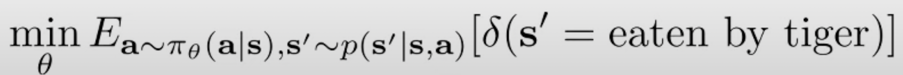

# PART03,04 : Case Study

## PART 03 요약

Drone을 이용한 Imitation Learning

- Drone을 이용해 숲을 통과하는 연구
- Drone은 전방, 양 측방 카메라 3대로 상황 인지를 통해 좌측 회전, 직진, 우측 회전을 선택
- 학습용 데이터는 사람이 직접 걸어다니며 생성
    - 사람이 숲을 걸어다니며 앞의 상황을 보고 몸의 방향을 회전
    - 이를 이용해 드론이 Imitation Learning

## PART 04 요약

### Problem of Imitation Learning

- 사람이 직접 데이터를 줘야 함
    - 딥러닝은 데이터가 많을수록 잘 학습하는데, 만들기 어려움
    - 그냥 걸어다니는 역할정도는 간단히 할 수 있지만,
    모든 관절을 움직이는 휴머노이드 로봇같은 분야에서는 어려움
- 사람은 자연스럽게 배우는데, 그걸 로봇이 할 수 있게 하면 안됨?
    - 경험에 대한 데이터의 제한을 없애고
    - 계속해서 성장할 수 있게 돕자.
- 그럴려면 목적을 만들고 강화하게 해야 함

### 목적 함수(호랑이 예시)

$\delta$ : sum of things that we don’t want

- 즉, “우리가 먹힌다는 상태의 합의 기대값”을 최소화하자
- action은 policy에 따르고
- 다음 state는 action과 현재 state의 probaility를 따름

- 조금 더 일반화하면, 
State가 1부터 T까지 변하고, Action도 1부터 T까지 변할 때,
현재 상태가 호랑이에게 잡아먹히는 상태의 기대값을 최소화

- 조금 더 일반화하면
state와 action에 따른 현재의 cost function의 기대값을 최소화
여기서, cost function은 호랑이에게 잡아먹히는 상황을 의미
- 다른 관점으로 보면,
Cost를 최소화 =  Reward 최대화
$r(s_t,a_t)$를 최대화 하자.
- 다이나믹 프로그래밍은 r(s,a)를 최대화하고,
로봇 연구에서는 c(x,u)를 최소화함