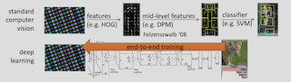

# PART02 : Why should we care about deep
reinforcement learning?

### Youtube Link

[https://www.youtube.com/watch?v=IoF7D0qec0I&list=PL_iWQOsE6TfXxKgI1GgyV1B_Xa0DxE5eH&index=2](https://www.youtube.com/watch?v=IoF7D0qec0I&list=PL_iWQOsE6TfXxKgI1GgyV1B_Xa0DxE5eH&index=2)

## 1. How do we build Intelligent Machines?

### Intelligent Machine이란?

만화에서 나타나는 Machines는 가정적인 일, 의료적인 일뿐만 아니라 나쁜 일까지도 한다.

### Intelligent Machine은 “적응"할 수 있어야한다.

실제 세계의 예측하기 어려운 것들과 복잡한 것들에 유동적으로 적응할 수 있어야 한다.

Example ) 자동 oil tanker를 만들자.

- 바다 위를 항해해서 지구 반대편의 목적지까지 어떻게 가느냐?
    - 요즘엔 어렵지 않을거다.
    - GPS + Motion Planning을 조합해 해결 가능
- 그럼에도 사람들이 배에 타는 이유는 무엇인가?
    - ‘무언가 잘못될 경우를 대비하여’
    - 엔진 등에 이상이 생기면 사람이 가서 고쳐야하기 때문
    
    ⇒ Navigate 자체는 어렵지 않으나, 
    긴급한 상황이 발생했을 때 대비하는 기술은 현재로썬 난이도가 높음
    

## 2. 딥러닝의 응용

### 딥러닝이 비정형화된 환경을 다루도록 도와준다.

비정형화된 환경 = 실제 세계

- 구조화되지 않음
- 예측하기 어려움

⇒ 이런 환경을 처리할 수 있도록 도와주는게 “딥러닝”

### 딥러닝의 특징

딥러닝은 엄청나게 거대한 (over parametrized) 모델을 이용하여 input과 output을 매핑한다.

- 이미지 인식
    - input : 많은 양의 이미지
    - output : 실제 정답값
    
    ⇒ 파라미터들을 학습시켜 실제 이미지를 인식함
    

다만 딥러닝은 기본적으로 “large over-parameterized models”를 선택하는 것이다.

- 즉, 무언가 알고리즘을 구축하는게 아님

Supervised Learning의 경우

- 이미지 분류, NMT, image를 이용한 사람의 말 인식까지 가능한 모델들이 개발되고 있음

즉, 딥러닝은

- 실제 세계의 settings를 가지고
- 아직까지 본 적이 없거나 굉장히 특수하거나 이상한 case까지도
- 효과적으로 일반화 할 수 있어야 함.

## 3. 강화학습

### 강화학습은 행동에 formalism(형식)을 제공한다.

formalism for behavior

- “it provides a mathematical way of thinking about sequential  decision-making”
- 강화학습은 순차적 의사결정에 수학적 방법을 제공함

### 강화학습의 특징

다음의 과정을 반복함

- agent가 실제 세계와 상호작용
- 실제 세계는 state와 reward를 얻음

⇒ 이 과정을 DNN으로 조합하여 유연하게 적용해야하는 다양한 분야에 적용함 

DNN은

- 유연하게 대처해야하는 분야
- 비일상적이고 예측 불가능한 상황에 적용할 수 있다.

⇒ 따라서 이를 강화학습에 적용하자.

Example 1 ) Backgammon 게임

- 백개먼 보드게임을 강화학습과 DNN을 이용해 학습
- td 개먼이라 불리는 system은 챔피언을 이길 정도는 아니지만, 전문가까지는 이기는 시스템을 구축했음

Example 2) Go

- 알파고는 2016년에 바둑의 human champion까지 이김
- td 개먼과 비슷한 system이 있음

그 외 ) robot locomotion (로봇 이동)부터 로봇 조작으로 video game까지 다양

## 4. Deep RL이 무엇이고, 왜 신경써야 하는가?

### Subtopic : Deep RL vs RL

### CV를 가지고 이야기해보자.

Computer vision 변천사

ML을 활용한 CV

- Image의 픽셀부터 시작
- 이미지에서 Features를 잡아냄 (HOG features 등)
    - hand-designed low-level features
    - HOG : Histogram of Oriented Gradients
    - imaged의 지역적 gradient를 해당 영상의 특징으로 사용
- mid-level feature를 잡아냄 (DPM)
    - Deformable Parts Model 등
- 이후에 이를 간단한 classifier 모델에 통과시킴
    - SVM 등
    

DL이 적용된 후의 CV

- 내부적으로는 low-level, mid-level feature를 잡아내 classify하는건 동일
- 차이점은 “not designed by hand”임.
    - 즉, 사람이 직접 모든 feature를 손으로 작업해줄 필요가 없다.
- end-to-end로 딥러닝을 이용해 학습함
    - 해결해야하는 task에 최적 상태로 adapt함
- 따라서 호랑이나 재규어를 구분하기 위한 적절한 Histogram이나 ingredient features를 잡아낼 필요가 없다

### Deep RL vs RL

백개먼 가지고 이야기를 해보자.

일반적인 RL 가정

- 무언가 Feature를 추출 ⇒ game에 적용해 polices, value func등을 만듦 ⇒ tabular or linear representation을 통해 action 결정
- 그러나, 중요한 feature가 뭔지 모르면 이 상황을 가정하지 못함

⇒ 강화학습에도 전문적이고, 백개먼에도 전문적인 사람이어야 함

⇒ 그래서 강화학습이 과거에는 복잡한 문제를 해결하는데 도움이 안되었다.

Deep RL

- 딥러닝은 강화학습에 동일학 formula를 적용한다.
    - 일반적인 feature extraction 과정은 생략하고
    - 자동으로 feature를 파악하여
    - end-to-end로 학습
- 강화학습의 Setting에서
    - feature를 designing하는 문제 자체가 CV보다 약함
    - 따라서 Deep RL 방법은 강화학습 알고리즘 자체를 변형하는데 영향이 있다

## 5. 순차적 의사결정에서 end-to-end가 의미하는게 무엇인가?

### Not Intended Learning

Intended learning이 아니라면, recognition part와 control part를 개별적으로 다뤄야 함

- 즉, 호랑이 이미지 → recognition part → 호랑이 인식 → control part → 도망
- 위와 같이 분리되어 일어나야 함
- 따라서 모델을 “인지 모델"과 “action 모델" 2가지를 각각 정확하게 맞춰야 함

문제점

- 이게 독립적으로 학습되면 행동의 demand에 대한 정보를 못받음
- 어떤게 중요하고 어떤게 중요하지 않은지 Detection인지에 대한 정보를 모름
    
    ⇒ 즉, 어떤 행동이 costly이고, 어떤 행동이 less costly인지 모름
    
- 이러면 호랑이한테서 도망칠 때 문제가 될 수 있음

### Intended Learning

 따라서 intense system은

- 개별 motor loop를 닫아내고
- 전체적인 system을 end-to-end로 학습해야 함
    - 즉, 인지 파트와 행동 파트를 함께 학습해야 함
- 그러면 학습할 때 이 전체 system의 마지막 performance 직접 모델에 알려줌
    - 즉, 호랑이 → 인지 → 도망 의 관계가 아니라
    - 호랑이 → 도망의 모델이 된다

### 로봇 예시 (Not Intended Learning)

로봇 동작은 여러 stage로 구성이 되어있을 것임

- 관찰
- 상태 추정 (물체 위치 파악 등)
- modeling & prediction(해당 물체가 어떻게 움직일 것인지에 대한 파악)
- 나는 어떻게 움직일지에 대한 계획 수립
- low-level control
- 통제

이 개별적인 과정은 에러를 낼 수 있다.

- 잘못된 가정은 실제 세계에 영향을 못 줄 수 있다.
- 즉, 물체 위치 파악 실패 ⇒ 잘못된 계획 ⇒ 영향 X

### 로봇 예시 (Intended Learning)

Not Intended Learning의 문제를 해결

모든 stage에 demand를 쭈욱 전달함

- 이러면 로봇 제어에 대한 Deep RL 접근법을 생각하기 좋다.

로봇 제어

- CNN이 perceptron과 action을 수행
- 로봇의 카메라에 있는 이미지들이 이 네트워크의 bottom에서 학습되고
- 이 output이 로봇의 작동부분으로 넘어감

이 로봇을 두뇌의 축소판이라고 볼 수 있음

- 이미지 인지 = 시각 피질 = CNN
- 행동 = 운동 피질 = FNN
- 이 과정을 end-to-end로 이 task의 적절한 결과를 내게끔 학습
- 그러면 로봇이 경험을 통해 학습하고, 이 task를 학습하여, 모든 weights를 학습함

### 예전 이미지 예시

Deep NN으로 합치면 강화학습은 모든 문제에 적용 가능하다.

- 지도학습은 input과 output 감독을 필요로 하지만
- 강화학습은 감독 없이 rearwd feedback을 이용해 적절한 행동을 취하는게 목표임

⇒ 복잡한 문제를 end-to-end로 해결하는데 도움이 됨

Deep RL

- 강화학습은 수학적인 formalism과 알고리즘 기반을 제공
- Deep 모델은 알고리즘 기반을 실제 세계에 적용할 수 있도록 대표함

## 6. 그럼 이걸 왜 지금 공부해야 하는가?

### 3가지 이유

1. Advances in DL
    - 지난 수십년보다 지금이 Deep RL을 배우기 가장 좋은 시점
    - 딥러닝이 엄청나게 발전하여, 모델을 구축해 representation을 찾기 좋음
2.  Advances in RL
    - RL을 딥러닝 분야에 적용할 수 있을만큼 다양한 방법론이 나왔음
3. Advances in Computational Capability
    - 계산 용량의 증가가 1,2를 결합할 수 있게 만듦

### 과거 Deep RL 시도

- 1980년대에도 Deep RL을 통한 시도가 있었음
- 1990년대의 연구로 오늘날 사용하는 연구의 일부가 있음
    - high quality의 일반화를 위한 연구 기본자료 등
    - AI의 Deep NN이 RL과의 결합 가능성을 밝힌 자료 등
    - 커리큘럼 or Imitation 학습 : 사람을 가르치는 사람이 제시한 학습 방법으로 중대한 속도 증진에 영향
    - 계층적 학습 :  학습 시간의 단축
    - 이런 것들이 다 요즘에도 논의되고 있음
    - 강화학습 agents가 마르코프 환경이 아닌 범위를 다룸
        - 메모리를 결합하고 DL 방법을 재사용함
        - 과거에 대성공함
        - 1996년에 작성한 이 논문으로 백개먼 게임 시스템 구축
        

그럼에도 

- Raw Image Pixel을 활용하여 video game을 바로 play하거나
- 고도로 일반화된 스킬을 폭 넓게 배울 수 있는 로봇
- 바둑에서 세계 챔피언이 되는 Go 등