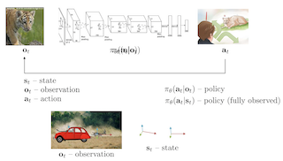

# PART01 : The Original Deep Imitation Learning

## 1. Technology & notation

### 용어 약자 및 설명

$o$ : observation : 어떠한 관찰

$\pi_\theta(a|o)$ : policy : maps observation to actions : 어떠한 관찰 속에서 행동을 하도록 만드는 정책, 

$\theta :$ 정책의 파라미터 (가중치)

$a   :$ action : 어떠한 행동

### 시간의 순서를 반영해보자

강화학습에서는 이산적 시계열 문제를 다룸

- 시간은 broken into litte discrete steps임 (쪼개질 수 있음)
- t는 정수로, 어떤 step인지를 의미

$s_t$ : 상태 : state는 마르코프 상태를 가정함

$o_t$ : t 시점의 관찰 : $s_t$의 결과로써 관찰되는 것

$\pi_\theta(a_t|o_t)$ : t시점에서의 관찰에 따른 행동 정책

$\pi_\theta(a_t|s_t)$ : t시점에서의 상태에 따른 행동 정책, 좀 더 제한적인 특수 상황 

$a_t$ : t시점에서의 행동

- 여기서 action(1. 도망 , 2. 무시, 3. 길들이기)에 대해 Softmax를 거쳐 행동을 선택
- 이 행동에 따라 다음 관찰 $o_{t+1}$에 영향을 줌
- 또한 $\pi_\theta$가 연속적 분포 (다변량 정규분포 or 가우시안 분포의 평균, 분산)라면 연속적 행동을 반환할 수 있음

현재의 행동이 다음의 관찰에 영향을 끼친다.

- t시점 호랑이 인식 실패
- 2번 행동 “무시" 선택
- t+1시점 더 가까워진 호랑이 상태

### $o_t$와 $s_t$의 차이

치타가 가젤을 쫓는 이미지를 가정하자.

- observation : 치타가 가젤을 쫓는다 + 픽셀로 이루어진 이미지의 집합
    - 픽셀 : 치타와 가젤이 어디에 있는지 찾아내야 함
- 그런데 이미지는 “underlying physics of some system”에 의해 생산됨
    - 이 시스템이 minimal representation과 같은 state를 반환
    - 따라서 $o_t$ 이미지는 시스템의 현재 배열 상태의 representation과 같다.
- 치타의 위치와 가젤의 위치와 속도를 보여줄 것이다.

위의 이미지와 같이, 자동차가 치타를 가렸다고 가정하자.

- full state를 추론할 수는 없다.
- 따라서 observation으로 상태를 추론하기엔 불충분하다.
- 그러나 state는 바뀌지는 않았다.
    - 치타가 가젤을 쫓는 것은 동일한 상황
- 따라서 이미지 픽셀과 관찰만 가지고 치타와 가젤의 위치를 파악하는건 불충분하다.

요약

- state : system의 true 배열 상태
- observation : state로 부터 나오는 결과물로써, 그 state를 정확히 추론하는게 어려울 수 있다.

### 그래프 모델의 용어로 설명할 수 있다.

state, action, observation에 대한 관계를 그릴 수 있다.

- state → observation , result
- observation → action , policy $\pi_\theta$
- action → next state

### 마르코프 특성

- “미래는 과거에 대해 조건부 독립”을 가정
- $p(s_{t+1}|s_t,a_t)$
    - p : 전이확률
    - 현재 state와 action를 통해 다음 state에 대한 확률을 알 수 있다.
    - 현재 state에 이전 state가 영향을 주지 못함을 의미한다. (독립)
- 강화학습과 연속적 의사결정에 있어서 매우 중요한 특성
    - 이 가정이 없다면 최적 정책 공식 마련을 하기 어렵다.
    - 또한 모든 state를 따져야 한다.
- 만약 정책이 “state”가 아닌 “observation”으로 관찰된다면??
    - observation이 조건부 독립인지 파악해야 한다.
    - 현재의 observation이 행동을 결정하고, 미래의 상태를 추정하는 역할 수행 여부까지 판단해야 한다.
    - 즉, 마르코프 가정을 불만족한다.
    - 왜냐면 현재의 관찰만으로는 미래를 결정하는게 어려움
    - 위의 치타 이미지만 봐도 답이 나옴
    - 과거의 관측치가 현재의 상태에 대한 추가적인 정보를 줄 수는 있어 의사 결정에 도움이 될 수 있다.
- non-마르코프를 가정한 방법들도 존재
    - 추후 다룰 예정

### notataion 추가자료

- Richard Bellman : $s_t$ for state, $a_t$ for action
    - 다이나믹 프로그래밍에서 나옴
- Lev Pontryagin : $x_t$ for state, $u_t$ for action
    - 로봇과 최적 제어 시스템에서 나옴
    - x는 알려지지 않은 값으로 대수학에서 쓰이고
    - u는 러시아 어로 action의 첫 단어임

## 2. Imitation Learning

### 수업 목표 설명

how we can learn policies

- 오늘은 매우 간단한 정책 학습 방법론
- 복잡한 알고리즘이 필요하지 않음
- 정책을 학습해 Image Classifier나 다른 종류의 모델에 적용해보자.

### 예시 : Driving a Car

Driving

- observation : 자동차 카메라
- action : 자동차 핸들 조정

Supervised Learning

- 운전 정책을 마련하기 위한 label data가 있다고 가정하자.
- 운전자의 이미지 + 모터 상태로 핸들을 어디로 돌리는지 학습
- 엄청나게 많은 데이터를 모아 학습
- Imitation Learning이고, Invitational Learning (Behavior Cloning)이라고도 부름
    - 사람 = Demonstrator이고, 주로 Expert임

Question) 진짜로 가능한가?

Answer)

- 오랫동안 연구되어온 주제
- Deep Imitation System or Neural Imitation System
    - 1989년에 제안되었었음 (by alvin)
    - alvin은 5개 hidden unit만 가지고도 실험했었음
    - 미국 횡단 실험도 했었음
- 하지만 대답은 일반적으로 NO!

Why?

- 학습은 가능해도, 문제가 생길 수 있음
- 왼쪽 축이 “상태", 오른쪽 축이 “시간"을 의미
    - 상태가 1Dim이 아니지만, 1Dim 이라고 가정하고 시각화하고 보자.
- 시간이 지남에 따른 상태의 변화를 나타난 그래프
- 검정 선 = Training Data의 궤적
    - 정책 학습에 사용 (s → a)
- 빨간 선 : 학습을 통해 얻어진 Policy를 통해 예측한 궤적
    - 매 학습마다 “약간의 오차"가 생김
    - 약간의 오차로 인해 상태의 변화가 생기고
    - 이 변화로 인해 다시 큰 오차가 발생하며 이 과정이 반복
    - 얼마 안지나도 엄청나게 큰 오차를 보이게 될 것임
- 자동차 운전에 대입하면, 핸들을 조금씩 꺾는 방향이 커지다가 보면 결국에는 도로에서 벗어남

### NVIDIA의 실험

- 2016년에 엄청나게 많은 데이터를 모아 약간의 trick까지 추가
- cone 사이를 주행하고, 도로에서 안벗어 나는데까지는 성공

How?

- 카메라를 3대를 사용
    - Center Cam : 가운데로 가려는 핸들
    - Left Cam : 왼쪽으로 기울어진 정도를 조정해 핸들을 오른쪽으로 기울이게 도와줌
    - Right Cam : 오른쪽으로 기울어진 정도를 조정하는 핸들을 왼쪽으로 기울이게 도와줌
- 운전 문제를 완화시킴
    - 왼쪽, 오른쪽 카메라가 작은 실수를 수정하고 이 문제를 수정하면 큰 실수로 벗어나지 않음

### 궤적 안정화

- 더 일반적인 원칙을 얘기해보자.
- 궤적상의 에러가 악화되기 전에, 학습용 데이터를 modify하자.
    - 약간의 mistake를 주면, 이 mistake를 수정하기 위해서 올바른 방향으로 이동할 것이다.
    - 이 과정도 학습하여 Mistake를 수정할 수 있다.
    - policy도 이런한 mistake → feedback을 학습해 안정화 됨
- 아니면 아예 mistake를 만들 사람한테도 부탁해서 데이터를 광범위하게 수집하자.
- 추후에 “stable optimal feedback controller”에 관해서 이야기 해볼 예정
    - 안정적인 정책 마련과 안정성 상속과 관련한 정책을 배울 수 있다.
    

### 어떻게 좀 더 적절한 모델을 만드는가?

- 정책은 $\pi_\theta(a_t|o_t)$와 같다.
- 수집한 데이터는 $p_{data}(o_t)$의 분포를 따른다.
- “데이터 분포상의 데이터를 잘 학습한다면, 학습하지 않았지만 분포 상에 존재하는 데이터는 잘 예측”으로 기대
- 정책을 돌리면 observation에 대한 데이터의 분포는 사실 다름
    - 정책이 다른 action을 낳고 그게 다시 다른 observation을 낳기 때문
    - $p_{\pi_\theta}(o_t)$가 $p_{data}(o_t)$와 많이 달라짐
- 그럼 저 2개의 분포를 어떻게 같게 만들어주는가?
    - 같게 만들어주면 잘 예측한다.
    - 즉 “좀 더 적절한 모델" = “$p_{\pi_\theta}(o_t) = p_{data}(o_t)$”

### $p_{\pi_\theta}(o_t) = p_{data}(o_t)$ 만들기

- 정책을 완벽하게 만들자.
    - 매우 어려움
- $p_{data}(o_t)$를 clever하게 만들자
    - 정책 자체를 수정하는건 어려움
    - 데이터의 분포 자체를 clever하게 만들자
- 정책을 수정하지 않으면서, 데이터를 수정하여
    - distributional shift를 피하자.

⇒ DAgger (Dataset Aggregation)

### DAgger

- 학습용 데이터를 $p_{\pi_\theta}(o_t)$에서 수집하자.
    - $p_{data}(o_t)$대신에
- just run $\pi_\theta(a_t|o_t)$
    - $o_t$가 $p_{\pi_\theta}(o_t)$를 따르는 데이터 분포상에 존재
    - 그러면 특정 $o_t$에 대한 action label만 있으면 됨
- 단계
    1. train $\pi_\theta(a_t|o_t)$ from human data $\mathcal{D} = \{o_1,a_1, ...,o_N,a_N\}$
    2. run $\pi_\theta(a_t|o_t)$ to get dataset $\mathcal{D_\pi} = \{o_1, ...,o_M\}$
    3. Ask human to label $\mathcal{D}$ with actions $a_t$
    4. Aggreate $\mathcal{D} \larr D \cup D_\pi$
    5. 1단계 재수행
    
    ⇒ 여러번 반복
    
- 최종적으로는 정책에 대한 $\theta$가 수정되고 정책을 따르는 데이터의 분포가 관측치 데이터의 분포와 유사해진다.
- 사용 안하는 이유
    - 3단계에서 사용
    - 사람이 라벨을 다는게 힘듬
- 드론을 이용해서 숲을 빠져나가는 실험에서 성공적으로 수행

질문 ) DAgger가 원본 데이터의 분포와 정책을 따르는 데이터의 분포가 달라 생기는 문제를 해결하기위해, 정책을 따르는 데이터 분포에서 obeservation을 관측해 재학습 시키는데 의의를 두었다고 이해했습니다. 그런데 “잘못 학습된 정책에서 observation을 관측해 학습”이라는 아이디어가 애초에 잘못 학습한 정책에서 가져온 데이터였다면, 너무 의미없는 데이터 (?)까지 학습할 것 같은데, DAgger가 의미있는 이유가 궁금합니다.

우선 제 생각은  궤적 자체를 안정화하기 위한 방법중  “mistake error”를 고의로 학습시켜, 데이터의 분포를 더 넓게 학습함으로써 데이터를 더 안정화 했고, 그 방법으로써 DAgger를 소개했을 것 같습니다.
다른 분들의 생각이 궁금합니다!

[https://jayhong1999.notion.site/PART01-The-Original-Deep-Imitation-Learning-0c62eaf2f9964824bfcdc33f97e50e18](https://www.notion.so/PART01-The-Original-Deep-Imitation-Learning-0c62eaf2f9964824bfcdc33f97e50e18)
제가 정리한 내용 중에는 “DAgger” 파트와 “궤적 안정화”입니다.